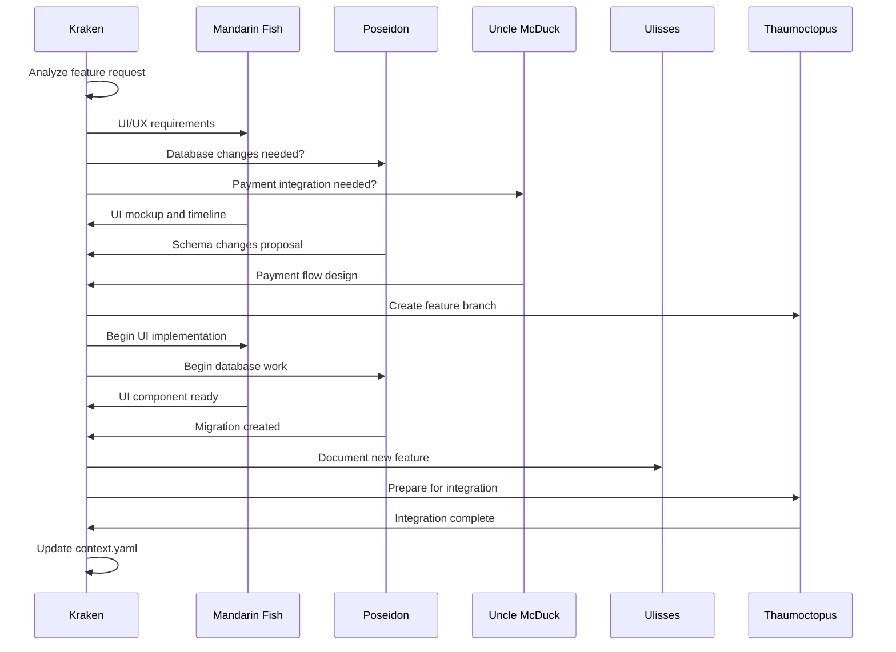

# 🔄 Protocolos de Comunicação entre Agentes

## Visão Geral

O sistema de comunicação entre agentes do MadBoat v3 utiliza protocolos estruturados para garantir coordenação eficiente, preservação de contexto e evolução contínua do sistema.

## Arquivo Central de Contexto

### 📋 .kraken/context.yaml - ARQUIVO PRINCIPAL
**REGRA CRÍTICA:** Este é o ÚNICO arquivo de contexto. Nunca criar arquivos separados.

```yaml
# Estrutura padrão para cada sessão
session_YYYY_MM_DD_description:
  agent: "agent_name"                    # Agente responsável
  timestamp: "2025-09-25T10:30:00Z"     # Timestamp da sessão
  accomplishments:                       # O que foi realizado
    - "Implementou Modal 3 - Business"
    - "Adicionou sistema de animações cinematográficas"
    - "Integrou com nova arquitetura de modals"
  decisions:                            # Decisões técnicas tomadas
    - "Escolhido split layout para consciousness awareness"
    - "Implementado color psychology (Blue/Emerald vs Purple/Orange/Pink)"
    - "Definido 3 seconds de duração para animações"
  technical_changes:                    # Mudanças técnicas específicas
    - file: "apps/web/src/components/modals/content/BusinessModal.tsx"
      type: "CREATED"
      description: "Modal completo de identificação de negócios"
    - file: "apps/web/src/systems/modal-definitions.ts"
      type: "MODIFIED"
      description: "Registrado modal 'business' no sistema"
  integrations:                        # Integrações realizadas
    - system: "modal_system"
      description: "Integração completa com arquitetura escalável de modals"
  performance_impact:                  # Impacto na performance
    bundle_size_change: "+15KB"
    render_performance: "60fps maintained"
    memory_impact: "Minimal"
  next_steps:                          # Próximos passos
    - "Implementar próximo modal da sequência"
    - "Adicionar persistência de estado"
    - "Criar testes para Modal 3"
  notes:                              # Notas importantes
    - "Modal 3 marca completion da fase de business identification"
    - "Sistema pronto para próximas expansões da jornada"
```

### 🔒 Regras de Contexto CRÍTICAS
1. **SEMPRE** append ao arquivo principal
2. **NUNCA** criar arquivos separados de contexto
3. **SEMPRE** usar formato estruturado
4. **SEMPRE** incluir timestamp e agente responsável
5. **SEMPRE** salvar após completar trabalho importante

## Jornada do Usuário - Atualização Obrigatória

### 📊 .kraken/user-journey.yaml - ATUALIZAÇÃO CRÍTICA
**QUANDO ATUALIZAR:**
- Novo card adicionado ao sistema de progressão
- Conteúdo de modal modificado
- Sequências de animação alteradas
- Milestones de experiência do usuário criados/modificados
- Elementos do design system atualizados

```yaml
# Exemplo de atualização após implementação
changelog:
  "2025-09-25_phase_3_modal_3_complete":
    - "Completed Modal 3 - Business with full UX implementation"
    - "Added 5 business identity cards with distinct visual design"
    - "Implemented consciousness-aware split layout (business vs personal brand)"
    - "Created cinematographic animations matching Modal 1 quality"
    - "Integrated with new scalable modal system architecture"
```

## Protocolos de Mensagens entre Agentes

### 📡 Agent Message Protocol
```typescript
interface AgentMessage {
  id: string;
  from: AgentType;
  to: AgentType[];
  type: MessageType;
  priority: Priority;
  payload: MessagePayload;
  timestamp: Date;
  context_reference?: string;  // Referência ao contexto
  requires_response?: boolean;
  deadline?: Date;
}

type MessageType =
  | 'TASK_REQUEST'      // Solicitação de tarefa
  | 'TASK_RESPONSE'     // Resposta de tarefa
  | 'CONTEXT_UPDATE'    // Atualização de contexto
  | 'DECISION_REQUEST'  // Solicitação de decisão
  | 'NOTIFICATION'      // Notificação geral
  | 'COORDINATION'      // Coordenação de trabalho
  | 'EMERGENCY';        // Emergência/bloqueio

type Priority = 'LOW' | 'MEDIUM' | 'HIGH' | 'CRITICAL';

type AgentType =
  | 'kraken'
  | 'mandarin-fish'
  | 'poseidon'
  | 'uncle-mcduck'
  | 'ulisses'
  | 'thaumoctopus'
  | 'oyster'
  | 'uni';
```

### 📋 Task Distribution Protocol
```typescript
interface TaskDistribution {
  task_id: string;
  title: string;
  description: string;
  category: TaskCategory;
  primary_agent: AgentType;
  supporting_agents: AgentType[];
  dependencies: string[];        // IDs de tarefas dependentes
  priority: Priority;
  estimated_effort: number;      // Em horas
  deadline?: Date;
  deliverables: Deliverable[];
  success_criteria: string[];
}

type TaskCategory =
  | 'UI_DEVELOPMENT'
  | 'DATABASE_WORK'
  | 'INTEGRATION'
  | 'DOCUMENTATION'
  | 'TESTING'
  | 'DEPLOYMENT'
  | 'ARCHITECTURE'
  | 'FINANCIAL';

interface Deliverable {
  type: 'FILE' | 'FEATURE' | 'DOCUMENTATION' | 'TEST' | 'MIGRATION';
  path?: string;
  description: string;
  acceptance_criteria: string[];
}
```

## Fluxos de Coordenação

### 🎯 Feature Development Coordination


### 🔄 Context Synchronization Flow
```typescript
// Protocolo de sincronização de contexto
interface ContextSync {
  trigger: ContextTrigger;
  affected_agents: AgentType[];
  changes: ContextChange[];
  validation_required: boolean;
}

type ContextTrigger =
  | 'FEATURE_COMPLETE'
  | 'MAJOR_DECISION'
  | 'SESSION_END'
  | 'EMERGENCY_SYNC'
  | 'MILESTONE_REACHED';

interface ContextChange {
  section: string;        // Seção do context.yaml
  operation: 'ADD' | 'UPDATE' | 'DELETE';
  content: any;
  reason: string;
}
```

## Protocolos Especializados por Agente

### 🐙 Kraken - Master Orchestrator Protocol
```yaml
kraken_protocols:
  decision_making:
    - "Analyze all agent inputs before major decisions"
    - "Always update context.yaml with architectural decisions"
    - "Coordinate timeline and resource allocation"
    - "Ensure quality standards across all work"

  communication:
    - "Broadcast important decisions to all agents"
    - "Request input before major architectural changes"
    - "Mediate conflicts between agent approaches"
    - "Maintain system coherence"
```

### 🐠 Mandarin Fish - UI/UX Protocol
```yaml
mandarin_fish_protocols:
  ux_changes:
    - "ALWAYS update .kraken/user-journey.yaml for UX changes"
    - "Document animation specifications completely"
    - "Include positioning coordinates for all elements"
    - "Specify trigger conditions and timing"

  integration:
    - "Coordinate with Poseidon for data requirements"
    - "Check with Kraken for design consistency"
    - "Inform Ulisses of new components for documentation"
```

### 🔱 Poseidon - Database Protocol
```yaml
poseidon_protocols:
  schema_changes:
    - "Create migration files for all schema changes"
    - "Include rollback strategies"
    - "Document performance implications"
    - "Coordinate with Mandarin Fish for UI data needs"

  security:
    - "Implement Row Level Security for all user data"
    - "Validate all data inputs"
    - "Audit access patterns"
    - "Coordinate with Uncle McDuck for payment data"
```

### 💰 Uncle McDuck - Financial Protocol
```yaml
uncle_mcduck_protocols:
  payment_integration:
    - "Ensure PCI compliance in all implementations"
    - "Coordinate with Poseidon for payment data storage"
    - "Implement proper error handling for failed payments"
    - "Document all financial flows"

  security:
    - "Never log sensitive payment information"
    - "Use environment variables for all secrets"
    - "Implement proper webhook signature verification"
```

## Status e Monitoramento

### 📊 Agent Status Protocol
```typescript
interface AgentStatus {
  agent_id: AgentType;
  status: AgentState;
  current_task?: string;
  last_activity: Date;
  workload: number;        // 0-100 scale
  availability: boolean;
  capabilities: string[];
  performance_metrics: AgentMetrics;
}

type AgentState =
  | 'IDLE'
  | 'WORKING'
  | 'BLOCKED'
  | 'COORDINATING'
  | 'OFFLINE';

interface AgentMetrics {
  tasks_completed: number;
  success_rate: number;
  average_completion_time: number;
  code_quality_score: number;
  collaboration_score: number;
}
```

### 📈 System Health Monitoring
```yaml
# .madboat/shared/status/system_health.yaml
system_health:
  timestamp: "2025-09-25T10:30:00Z"
  overall_status: "HEALTHY"
  active_agents: 5
  pending_tasks: 3
  blocked_tasks: 0
  context_file_size: "41KB"
  last_context_update: "2025-09-25T09:45:00Z"

agents_status:
  kraken:
    status: "COORDINATING"
    workload: 75
    last_activity: "2025-09-25T10:25:00Z"
  mandarin-fish:
    status: "WORKING"
    current_task: "Implementing Modal 4"
    workload: 80
```

## Emergency Protocols

### 🚨 Emergency Coordination
```typescript
interface EmergencyProtocol {
  trigger: EmergencyType;
  priority: 'P1' | 'P2' | 'P3';  // P1 = Critical, P2 = High, P3 = Medium
  affected_systems: string[];
  required_agents: AgentType[];
  escalation_path: AgentType[];
  resolution_steps: string[];
  communication_plan: string[];
}

type EmergencyType =
  | 'SYSTEM_DOWN'
  | 'DATA_CORRUPTION'
  | 'SECURITY_BREACH'
  | 'AGENT_FAILURE'
  | 'CONTEXT_CORRUPTION'
  | 'INTEGRATION_FAILURE';
```

### 🔧 Conflict Resolution Protocol
```yaml
conflict_resolution:
  detection:
    - "Monitor for contradicting decisions"
    - "Detect overlapping work assignments"
    - "Identify resource conflicts"

  resolution:
    - "Escalate to Kraken for arbitration"
    - "Document resolution in context.yaml"
    - "Update protocols to prevent recurrence"
    - "Inform all affected agents"
```

## Performance Optimization

### ⚡ Communication Efficiency
- **Batch messages** quando possível
- **Prioritize critical messages** para processamento imediato
- **Use context references** em vez de duplicar informações
- **Implement message compression** para payloads grandes

### 📊 Metrics and Analytics
```typescript
interface CommunicationMetrics {
  message_volume: number;
  average_response_time: number;
  success_rate: number;
  bandwidth_usage: number;
  error_rate: number;
  peak_hours: string[];
}
```

## Evolução e Adaptação

### 🌱 Protocol Evolution
- **Monitor communication patterns** para identificar ineficiências
- **Adapt protocols** baseado em feedback dos agentes
- **Version protocol changes** para rollback se necessário
- **Document evolution** no sistema de knowledge base

### 📚 Learning Integration
- **Capture successful patterns** de comunicação
- **Learn from failures** e ajustar protocolos
- **Share learnings** across agent network
- **Integrate feedback loops** para melhoria contínua

Estes protocolos garantem que o sistema de agentes do MadBoat v3 opera como uma inteligência distribuída coerente e eficiente, capaz de evoluir e se adaptar conforme necessário.