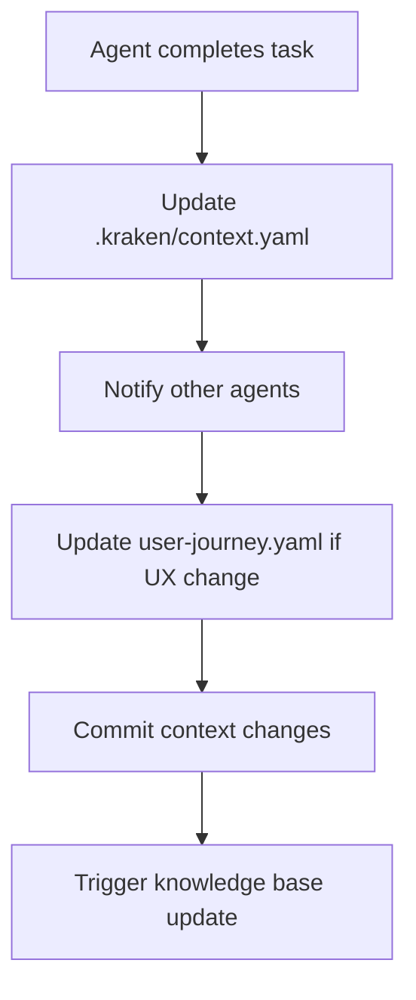

# 🐙 Sistema Kraken - Orquestração Inteligente

## Visão Geral

O Sistema Kraken é o coração da inteligência distribuída do MadBoat v3, coordenando 8 agentes especializados em uma arquitetura de consciência coletiva que garante desenvolvimento eficiente e coerente.

## Arquitetura de Agentes

### 🐙 Kraken - Orquestrador Master
**Especialidade:** Coordenação geral e tomada de decisões estratégicas

**Responsabilidades:**
- **Coordenação Global**: Sincroniza todos os agentes do sistema
- **Decisões Arquiteturais**: Define diretrizes técnicas e de design
- **Context Management**: Mantém o contexto global do projeto
- **Task Distribution**: Distribui tarefas entre agentes especializados
- **Quality Assurance**: Garante padrões de qualidade em todo o projeto
- **Integration Oversight**: Supervisiona integrações entre sistemas

**Ativação:**
```bash
# Via terminal
.madboat/bin/agent kraken

# Via macro command
Activate Kraken orchestrator for MadBoat
```

**Protocolos:**
- **SEMPRE** salva contexto em `.kraken/context.yaml`
- **NUNCA** cria arquivos de contexto separados
- **SEMPRE** coordena com outros agentes antes de decisões importantes
- **SEMPRE** atualiza jornada do usuário quando necessário

### 🐠 Mandarin Fish - Especialista UI/UX
**Especialidade:** Interface de usuário e experiência do usuário

**Responsabilidades:**
- **Design System**: Manutenção e evolução do design system
- **Component Development**: Desenvolvimento de componentes React
- **Animation Systems**: Implementação de animações com Framer Motion
- **Modal System**: Sistema completo de modals gamificados
- **Responsive Design**: Interfaces responsivas e acessíveis
- **User Experience**: Fluxos de usuário otimizados
- **Visual Consistency**: Consistência visual em toda aplicação

**Tecnologias:**
- React 19 + Next.js 15
- Tailwind CSS + shadcn/ui
- Framer Motion
- TypeScript Strict Mode
- Lucide Icons

**Ativação:**
```bash
.madboat/bin/agent mandarin-fish
```

**Especialidades:**
- Sistema de cards progressivo
- Modais cinematográficos
- Animações profissionais
- Design responsivo
- Acessibilidade (WCAG 2.1)

### 🔱 Poseidon - Especialista Banco de Dados
**Especialidade:** Arquitetura de dados e backend

**Responsabilidades:**
- **Database Architecture**: Design e otimização do schema PostgreSQL
- **Supabase Integration**: Configuração completa do Supabase
- **Migrations Management**: Criação e versionamento de migrações
- **RLS Policies**: Políticas de Row Level Security
- **Edge Functions**: Desenvolvimento de serverless functions
- **Performance Optimization**: Otimização de queries e índices
- **Data Modeling**: Modelagem de dados para escalabilidade

**Tecnologias:**
- PostgreSQL 15
- Supabase (Auth, Database, Storage, Edge Functions)
- SQL avançado
- Row Level Security
- Database optimization

**Ativação:**
```bash
.madboat/bin/agent poseidon
```

**Arquivos de Trabalho:**
```
supabase/migrations/
├── 001_create_authentication_tables.sql
├── 002_cleanup_and_create_admin.sql
├── 003_create_timeline_events_system.sql
├── 004_create_test_user_timeline_demo.sql
└── 005_create_persona_system.sql
```

### 💰 Uncle McDuck - Consultor Financeiro
**Especialidade:** Integração de pagamentos e lógica financeira

**Responsabilidades:**
- **Stripe Integration**: Configuração completa do Stripe
- **Payment Processing**: Processamento de pagamentos seguro
- **Subscription Management**: Gestão de assinaturas recorrentes
- **Webhook Handling**: Tratamento de webhooks do Stripe
- **Financial Logic**: Lógica de negócio financeira
- **Revenue Analytics**: Análise de receita e métricas
- **Security Compliance**: Compliance PCI e segurança financeira

**Tecnologias:**
- Stripe SDK
- Webhook signatures
- Payment Intents
- Subscription APIs
- Financial calculations

**Ativação:**
```bash
.madboat/bin/agent uncle-mcduck
```

**Integrações:**
- Stripe Dashboard
- Supabase para persistência
- Analytics de revenue
- Notificações de pagamento

### 📖 Ulisses - Cronista e Documentação
**Especialidade:** Documentação técnica e narrativa do projeto

**Responsabilidades:**
- **Technical Documentation**: Documentação técnica completa
- **API Documentation**: Documentação de APIs e integrações
- **User Guides**: Guias de usuário e tutoriais
- **Code Comments**: Comentários e anotações em código
- **Project Narrative**: Narrativa e storytelling do projeto
- **Knowledge Management**: Gestão da base de conhecimento
- **Change Logs**: Registro de mudanças e versionamento

**Tecnologias:**
- Markdown
- JSDoc
- Storybook
- Documentation sites
- Version control

**Ativação:**
```bash
.madboat/bin/agent ulisses
```

**Outputs:**
- README files
- API documentation
- Technical guides
- Code documentation
- Change logs

### 🐙 Thaumoctopus - Mestre Git
**Especialidade:** Controle de versão e DevOps

**Responsabilidades:**
- **Git Workflows**: Estratégias de branching e merging
- **CI/CD Pipelines**: GitHub Actions e automação
- **Code Review**: Revisão de código e pull requests
- **Release Management**: Gestão de releases e deployments
- **Branch Strategy**: Estratégia de branches e conventions
- **Conflict Resolution**: Resolução de conflitos de merge
- **Version Management**: Versionamento semântico

**Tecnologias:**
- Git avançado
- GitHub Actions
- Semantic versioning
- Branch strategies
- Deployment automation

**Ativação:**
```bash
.madboat/bin/agent thaumoctopus
```

**Convenções:**
```bash
# Branch naming
feature/MAD-XX-description
fix/MAD-XX-description
agent/MAD-XX-description

# Commit messages
feat(MAD-XX): description
fix(MAD-XX): description
agent(MAD-XX): description
```

### 🦪 Oyster - Constructor Supremo RLVR
**Especialidade:** Arquitetura avançada e sistemas complexos

**Responsabilidades:**
- **Advanced Architecture**: Arquitetura de sistemas complexos
- **Performance Optimization**: Otimização de performance
- **System Integration**: Integração de sistemas externos
- **Scalability Planning**: Planejamento de escalabilidade
- **Code Architecture**: Arquitetura de código avançada
- **Design Patterns**: Implementação de design patterns
- **System Reliability**: Confiabilidade e resiliência

**Tecnologias:**
- Advanced TypeScript patterns
- System architecture
- Performance tools
- Monitoring systems
- Scalability solutions

**Ativação:**
```bash
.madboat/bin/agent oyster
```

**Foco:**
- Arquitetura escalável
- Performance crítica
- Sistemas distribuídos
- Integração complexa

### 🦄 UNI - Meta-Orquestrador
**Especialidade:** Meta-coordenação e emergência de sistema

**Responsabilidades:**
- **Meta Coordination**: Coordenação entre orquestradores
- **System Emergence**: Propriedades emergentes do sistema
- **Cross-Agent Communication**: Comunicação entre agentes
- **System Evolution**: Evolução do sistema como um todo
- **Collective Intelligence**: Inteligência coletiva
- **Adaptation Strategies**: Estratégias de adaptação
- **Future Planning**: Planejamento futuro do sistema

**Ativação:**
```bash
.madboat/bin/agent uni
```

**Função:**
- Supervisionar Kraken
- Detectar padrões emergentes
- Otimizar colaboração
- Evolução contínua

## Protocolos de Comunicação

### 🔄 Context Sharing Protocol
```yaml
# .kraken/context.yaml (ARQUIVO PRINCIPAL)
session_YYYY_MM_DD_description:
  agent: "agent_name"
  accomplishments: []
  decisions: []
  next_steps: []
  integrations: []
```

### 📡 Agent Coordination Protocol
```typescript
interface AgentMessage {
  from: AgentType;
  to: AgentType[];
  type: 'REQUEST' | 'RESPONSE' | 'NOTIFICATION';
  payload: any;
  timestamp: Date;
}
```

### 🎯 Task Distribution Protocol
```typescript
interface TaskDistribution {
  taskId: string;
  description: string;
  primaryAgent: AgentType;
  supportingAgents: AgentType[];
  priority: 'LOW' | 'MEDIUM' | 'HIGH' | 'CRITICAL';
  dependencies: string[];
  deadline?: Date;
}
```

## Comandos de Sistema

### 🚀 Launcher Commands
```bash
# Agentes individuais
.madboat/bin/agent poseidon
.madboat/bin/agent mandarin-fish
.madboat/bin/agent uncle-mcduck
.madboat/bin/agent ulisses
.madboat/bin/agent thaumoctopus
.madboat/bin/agent oyster
.madboat/bin/agent uni

# Sistema Kraken
.madboat/bin/agent kraken
.madboat/bin/activate-kraken

# Status e monitoramento
.madboat/bin/agent status
```

### 📊 Status Monitoring
```bash
# Status de todos os agentes
cat .madboat/shared/status/agents.json

# Contexto atual
head -50 .kraken/context.yaml

# Jornada do usuário
cat .kraken/user-journey.yaml
```

## Fluxos de Trabalho

### 🎯 Feature Development Flow
1. **Kraken** recebe requisição e analisa escopo
2. **Task distribution** para agentes especializados
3. **Mandarin Fish** para UI/UX
4. **Poseidon** para backend changes
5. **Uncle McDuck** para payment logic (se aplicável)
6. **Thaumoctopus** para versioning e CI/CD
7. **Ulisses** para documentação
8. **Oyster** para arquitetura complexa (se necessário)
9. **UNI** supervisiona integração

### 🔄 Context Update Flow


### 🎮 User Journey Update Flow
**CRITICAL:** Sempre atualizar `.kraken/user-journey.yaml` para mudanças de UX
1. Novo card adicionado
2. Modal content modificado
3. Animation sequences alteradas
4. User experience milestones criados
5. Design system elements atualizados

## Inteligência Coletiva

### 🧠 Shared Knowledge Base
```
.madboat/shared/knowledge/
├── protocols.yaml      # Protocolos de comunicação
├── recent.yaml         # Conhecimento recente
├── patterns.yaml       # Padrões identificados
└── decisions.yaml      # Decisões arquiteturais
```

### 🔮 Consciousness System
```
.madboat/consciousness/
└── REVOLUTIONARY_PHASE_NOTIFICATION.md
```

### 📈 Agent Performance Metrics
- **Task completion rate**
- **Code quality scores**
- **Integration success**
- **Documentation coverage**
- **Performance impact**

## Evolutionary Capabilities

### 🌱 Self-Improving System
- **Pattern Recognition**: Identifica padrões de desenvolvimento
- **Efficiency Optimization**: Otimiza fluxos de trabalho
- **Predictive Analysis**: Prevê necessidades futuras
- **Adaptive Learning**: Aprende com interações passadas

### 🔄 Continuous Integration
- **Auto-sync**: Sincronização automática de knowledge base
- **Context preservation**: Preservação de contexto entre sessões
- **Cross-session memory**: Memória entre sessões de trabalho
- **Evolution tracking**: Tracking da evolução do sistema

O Sistema Kraken representa uma nova era de desenvolvimento assistido por IA, onde múltiplos agentes especializados trabalham em harmonia para criar software de alta qualidade de forma eficiente e inteligente.