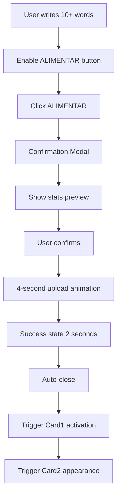

# 📱 Sistema de Modals - MadBoat v3

## Visão Geral

O sistema de modals do MadBoat v3 é uma arquitetura escalável e cinematográfica que oferece experiências imersivas através de modals temáticos. Cada modal representa uma etapa crucial na jornada do usuário, combinando storytelling, gamificação e coleta inteligente de dados.

## Arquitetura do Sistema

### 🏗️ Estrutura Técnica
```typescript
// Core Modal System Architecture
interface ModalSystem {
  renderer: 'React Portal-based';
  stateManagement: 'GameModalContext';
  animations: 'Framer Motion';
  zIndexManagement: 'Automatic layering';
  responsiveness: 'Mobile-first design';
}

// Modal Registry System
interface ModalRegistry {
  definitions: ModalDefinition[];
  handlers: Map<ModalType, ModalHandler>;
  animations: AnimationConfig[];
  themes: ModalTheme[];
}
```

### 📁 Estrutura de Arquivos
```
apps/web/src/components/modals/
├── ModalRenderer.tsx           # Renderer principal
├── GameModalContext.tsx        # Context de estado
├── content/                    # Conteúdo específico dos modals
│   ├── DiscoveryModal.tsx     # Modal 1 - Descoberta
│   ├── BusinessModal.tsx      # Modal 3 - Negócios
│   ├── DiaryModal.tsx         # Modal 2 - Diário (TBD)
│   └── [future-modals].tsx    # Próximos modals
└── hooks/
    ├── useModalSystem.ts       # Hook principal
    └── useModalAnimations.ts   # Hook de animações
```

### 🔧 Sistema de Registro
```typescript
// apps/web/src/systems/modal-definitions.ts
export const modalDefinitions = {
  discovery: {
    component: DiscoveryModal,
    animation: { duration: 3000, type: 'scale' },
    backdrop: { blur: true, opacity: 0.8 },
    closeOnBackdrop: false,
    theme: 'monochrome'
  },
  business: {
    component: BusinessModal,
    animation: { duration: 3000, type: 'expand' },
    backdrop: { blur: true, opacity: 0.9 },
    closeOnBackdrop: true,
    theme: 'consciousness-split'
  }
} as const;
```

## Modals Implementados

### 🎯 Modal 1: Discovery - "Quem sou eu na era da IA?"

#### Propósito
Ajudar usuários a identificar suas habilidades únicas e escrever sua história pessoal, criando uma base de dados para personalização da IA.

#### Arquitetura de Duas Etapas
```typescript
interface DiscoveryModalSteps {
  step1_skill_identification: {
    layout: 'split-screen';
    leftSide: {
      background: 'black';
      content: 'persuasive copy';
      purpose: 'motivation and context';
    };
    rightSide: {
      background: 'white';
      content: 'input form';
      validation: 'minimum 3 characters';
      transition: 'slides left on submission';
    };
  };

  step2_story_writing: {
    layout: 'sidebar + main area';
    sidebar: {
      background: 'black with rounded corners';
      content: 'motivational messaging';
      realTimeStats: {
        wordCount: 'live counting';
        readingTime: 'calculated at 250 words/min';
        button: 'ALIMENTAR (enabled at 10+ words)';
        icon: 'Database icon';
      };
    };
    diaryArea: {
      background: '#1E2022';
      format: 'paper-like diary';
      editing: 'contentEditable with auto-save simulation';
      features: 'direct editing, date footer';
    };
  };
}
```

#### Fluxo de Conclusão


#### Animações e Feedback
```typescript
interface DiscoveryAnimations {
  entrance: 'scale + opacity with backdrop blur';
  stepTransition: 'slide left with content fade';
  uploadProgress: {
    duration: '4 seconds';
    iconSequence: 'Database → Upload → CheckCircle';
    progressBar: 'linear fill animation';
  };
  exit: 'reverse scale with backdrop fade';
}
```

### 🏢 Modal 3: Business - "Qual tipo de negócio eu tenho?"

#### Propósito
Classificar o modelo de negócio do usuário através de uma interface que reconhece a dualidade entre "ter um negócio" vs "ser o negócio".

#### Layout Split Screen com Consciência Dual
```typescript
interface BusinessModalLayout {
  concept: 'consciousness-aware split layout';
  purpose: 'differentiate business ownership models';

  leftSection: {
    title: 'Eu tenho um negócio';
    background: 'black with blue/emerald accents';
    philosophy: 'traditional business ownership';
    colorPsychology: 'blue = trust/international, emerald = growth/national';
  };

  rightSection: {
    title: 'Eu sou meu negócio';
    background: 'white with purple/orange/pink accents';
    philosophy: 'personal brand and solopreneur model';
    colorPsychology: 'purple = strategy, orange = innovation, pink = engagement';
  };
}
```

#### Cards de Identificação
```typescript
interface BusinessCards {
  leftSectionCards: [
    {
      id: 'international-entrepreneur';
      title: 'Empresário Brasileiro que mora nos EUA';
      icon: 'Building2';
      gradient: 'blue gradient';
      description: 'Empresa estabelecida com operação internacional';
      psychology: 'trust, stability, international reach';
    },
    {
      id: 'national-entrepreneur';
      title: 'Empresário que mora no Brasil';
      icon: 'Briefcase';
      gradient: 'emerald gradient';
      description: 'Empresa nacional com visão de crescimento';
      psychology: 'growth, national pride, expansion';
    }
  ];

  rightSectionCards: [
    {
      id: 'marketing-strategist';
      title: 'Estrategista de Marketing';
      icon: 'Target';
      gradient: 'purple gradient';
      description: 'Especialista em crescimento e posicionamento';
      psychology: 'strategy, creativity, precision';
    },
    {
      id: 'vibe-developer';
      title: 'Desenvolvedor VibeCoding';
      icon: 'Code';
      gradient: 'orange gradient';
      description: 'Criador de soluções tecnológicas vibrantes';
      psychology: 'energy, innovation, creativity';
    },
    {
      id: 'traffic-manager';
      title: 'Gestor de tráfego';
      icon: 'Users';
      gradient: 'pink gradient';
      description: 'Especialista em acquisition e performance';
      psychology: 'engagement, performance, results';
    }
  ];
}
```

#### Animações Cinematográficas
```typescript
interface BusinessModalAnimations {
  entrance: {
    modal: 'scale from 0.8 to 1 with bounce';
    backdrop: 'opacity 0 to 0.9 with blur';
    duration: '800ms';
    easing: 'cubic-bezier(0.23, 1, 0.32, 1)';
  };

  cardEntrance: {
    pattern: 'staggered reveal';
    timing: '100ms intervals';
    animation: 'scale + opacity';
    order: 'left to right, top to bottom';
  };

  hoverEffects: {
    scale: '1.02';
    yTransform: '-5px';
    shimmerOverlay: 'gradient sweep animation';
    duration: '200ms';
    easing: 'ease-out';
  };

  selectionState: {
    ring: 'highlight ring with scale pulse';
    celebration: 'micro-scale celebration (1.05 → 1.0)';
    duration: '300ms';
  };

  modalExpansion: {
    duration: '3 seconds';
    customCloseHandling: true;
    exitAnimation: 'scale to 0 with rotation';
  };
}
```

### 📔 Modal 2: Diary - "Diário de Bordo" (TBD)

#### Status Atual
```typescript
interface DiaryModalStatus {
  implementation: 'Handler implemented';
  content: 'Pending definition';
  purpose: 'Access to user story collection';
  integration: 'Fully connected to card system';
}
```

#### Conceito Planejado
```typescript
interface DiaryModalConcept {
  purpose: 'Repository of user stories and AI training data';
  features: [
    'Story collection viewer',
    'Edit previous stories',
    'Add new stories',
    'AI insights based on stories',
    'Progress visualization',
    'Export functionality'
  ];
}
```

## Sistema de Estado e Context

### 🎮 GameModalContext
```typescript
interface GameModalContextState {
  // Current modal state
  currentModal: ModalType | null;
  isModalOpen: boolean;

  // User progress tracking
  storySubmitted: boolean;
  userSkill: string;
  userStory: string;
  businessTypeSelected: string | null;

  // Card unlock state
  unlockedCards: number[];
  completedMilestones: string[];

  // Session data
  sessionStartTime: Date;
  modalInteractions: ModalInteraction[];
}

interface ModalInteraction {
  modalType: ModalType;
  action: string;
  timestamp: Date;
  duration?: number;
  data?: any;
}
```

### 🔄 State Management Patterns
```typescript
// Context actions
const gameModalActions = {
  openModal: (type: ModalType) => void;
  closeModal: () => void;
  submitStory: (story: string, skill: string) => Promise<void>;
  selectBusinessType: (type: string) => void;
  trackInteraction: (interaction: ModalInteraction) => void;
  resetProgress: () => void;
};

// Persistence strategy
const persistenceConfig = {
  localStorage: ['storySubmitted', 'userSkill', 'businessTypeSelected'];
  sessionStorage: ['currentModal', 'sessionStartTime'];
  database: ['userStory', 'completedMilestones', 'modalInteractions'];
};
```

## Animações e Transições

### 🎬 Animation System
```typescript
interface ModalAnimationSystem {
  engine: 'Framer Motion';
  principles: [
    'Cinematographic quality',
    '60fps performance',
    'Meaningful transitions',
    'Accessibility support'
  ];

  globalSettings: {
    duration: 3000;              // Default modal duration
    easing: [0.23, 1, 0.32, 1]; // Professional cubic-bezier
    reduceMotion: 'respect';     // Respect user preferences
  };

  performance: {
    useHardwareAcceleration: true;
    optimizeReflows: true;
    batchAnimations: true;
    targetFPS: 60;
  };
}
```

### 🎨 Transition Patterns
```typescript
interface TransitionPatterns {
  modalEntrance: {
    backdrop: 'opacity 0 → 1 with blur 0 → 8px';
    modal: 'scale 0.8 → 1 with opacity 0 → 1';
    content: 'staged fade-ins with 100ms delays';
  };

  modalExit: {
    content: 'fade out 200ms';
    modal: 'scale 1 → 0.8 with opacity 1 → 0';
    backdrop: 'opacity 1 → 0 with blur 8px → 0';
  };

  contentTransitions: {
    stepChanges: 'slide left/right with crossfade';
    stateChanges: 'morphing with smooth interpolation';
    loadingStates: 'skeleton → content with fade';
  };
}
```

## Responsividade e Acessibilidade

### 📱 Responsive Design
```css
/* Modal responsive breakpoints */
.modal-container {
  /* Desktop (default) */
  width: 90vw;
  max-width: 1200px;
  height: 80vh;
  max-height: 800px;
}

@media (max-width: 1024px) {
  .modal-container {
    width: 95vw;
    height: 85vh;
  }

  .modal-split-layout {
    flex-direction: column;
  }
}

@media (max-width: 768px) {
  .modal-container {
    width: 100vw;
    height: 100vh;
    border-radius: 0;
  }

  .modal-cards-grid {
    grid-template-columns: 1fr;
    gap: 1rem;
  }
}
```

### ♿ Accessibility Features
```typescript
interface AccessibilityFeatures {
  keyboardNavigation: {
    tabOrder: 'logical and intuitive';
    escapeToClose: true;
    arrowNavigation: 'between cards';
    enterToSelect: true;
  };

  screenReader: {
    ariaLabels: 'comprehensive labeling';
    liveRegions: 'for dynamic content';
    roleDefinitions: 'proper ARIA roles';
    descriptions: 'detailed descriptions';
  };

  visualAccessibility: {
    highContrast: 'support for high contrast mode';
    reducedMotion: 'respect prefers-reduced-motion';
    focusIndicators: 'clear and visible focus states';
    colorBlindness: 'not reliant on color alone';
  };
}
```

## Performance e Otimização

### ⚡ Performance Strategy
```typescript
interface PerformanceOptimization {
  lazyLoading: {
    modalContent: 'load only when opened';
    images: 'lazy load with intersection observer';
    components: 'dynamic imports for large modals';
  };

  animations: {
    hardwareAcceleration: 'transform3d and will-change';
    animationBudget: 'max 3 simultaneous animations';
    frameDropProtection: 'monitor FPS and adapt';
  };

  memory: {
    modalCleanup: 'cleanup on close';
    eventListeners: 'proper cleanup';
    stateOptimization: 'minimal re-renders';
  };
}
```

### 📊 Performance Metrics
```typescript
interface ModalPerformanceMetrics {
  loadTime: number;           // Time to first render
  animationFPS: number;       // Average FPS during animations
  memoryUsage: number;        // Peak memory usage
  interactionLatency: number; // Click to response time
  bundleSize: number;         // Additional bundle size per modal
}
```

## Extensibilidade e Modularidade

### 🔌 Plugin Architecture
```typescript
interface ModalPlugin {
  name: string;
  version: string;
  modalTypes: ModalType[];
  hooks: ModalHook[];
  components: React.ComponentType[];
  animations: AnimationDefinition[];
  themes: ThemeDefinition[];
}

// Example plugin usage
const aiInsightsPlugin: ModalPlugin = {
  name: 'ai-insights',
  modalTypes: ['ai-analysis', 'insights-dashboard'],
  hooks: [useAIInsights, useInsightsData],
  // ... other plugin properties
};
```

### 🎯 Future Modal Types (Roadmap)
```typescript
interface FutureModals {
  aiTransformation: {
    purpose: 'Show how AI will transform user\'s work';
    trigger: 'business type selected';
    features: ['personalized AI insights', 'transformation roadmap'];
  };

  actionPlan: {
    purpose: 'Create personalized AI action plan';
    trigger: 'AI transformation modal completed';
    features: ['step-by-step plan', 'progress tracking'];
  };

  community: {
    purpose: 'Connect with similar professionals';
    trigger: 'action plan created';
    features: ['community matching', 'peer insights'];
  };

  mastery: {
    purpose: 'Advanced AI mastery training';
    trigger: 'community engagement threshold met';
    features: ['advanced courses', 'certification paths'];
  };
}
```

## Analytics e Insights

### 📈 Modal Analytics
```typescript
interface ModalAnalytics {
  engagement: {
    openRate: number;           // % of users who open modal
    completionRate: number;     // % who complete modal action
    timeSpent: number;          // Average time in modal
    dropoffPoints: string[];    // Where users typically drop off
  };

  interaction: {
    clickHeatmap: Position[];   // Where users click most
    scrollBehavior: number[];   // Scroll patterns
    formEngagement: number;     // Form field engagement
    errorRates: number;         // Error occurrence rates
  };

  conversion: {
    storySubmissionRate: number;    // Discovery modal conversion
    businessSelectionRate: number;  // Business modal conversion
    progressionRate: number;        // Overall journey progression
  };
}
```

### 🎯 Success Metrics
- **Modal Completion Rate**: 85%+ target
- **User Story Quality**: Average 50+ words
- **Business Classification Accuracy**: User validation surveys
- **Performance**: <100ms interaction latency
- **Accessibility**: WCAG 2.1 AA compliance

O sistema de modals do MadBoat v3 representa uma abordagem inovadora para coleta de dados do usuário, combinando storytelling cinematográfico com funcionalidade robusta e performance otimizada.