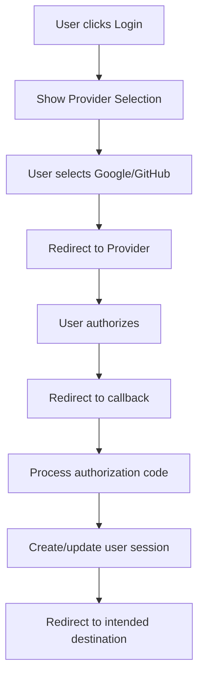

# 🔐 Fluxos de Autenticação - MadBoat v3

## Visão Geral

O sistema de autenticação do MadBoat v3 utiliza Supabase Auth para fornecer uma experiência segura e sem friction, com suporte a múltiplos providers OAuth e gerenciamento inteligente de sessões. O foco está em minimizar barreiras de entrada enquanto mantém segurança robusta.

## Arquitetura de Autenticação

### 🏗️ Stack de Autenticação
```typescript
interface AuthStack {
  provider: 'Supabase Auth';
  database: 'PostgreSQL with Row Level Security';
  frontend: 'Next.js 15 with Server Components';
  session: 'JWT tokens with automatic refresh';
  security: 'OAuth 2.0 + PKCE';
}
```

### 🔑 Providers Suportados
```typescript
interface AuthProviders {
  primary: {
    google: {
      priority: 'highest';
      reason: 'Most common, lowest friction';
      scopes: ['profile', 'email'];
    };
    github: {
      priority: 'high';
      reason: 'Developer-focused audience';
      scopes: ['user:email', 'read:user'];
    };
  };

  planned: {
    linkedin: 'Professional networking context';
    apple: 'iOS/macOS user preference';
    microsoft: 'Enterprise compatibility';
  };

  fallback: {
    email_password: 'Traditional fallback';
    magic_link: 'Passwordless email authentication';
  };
}
```

## Fluxos de Autenticação

### 🎯 Fluxo Principal (OAuth)

#### 1. Iniciação do Login


#### 2. Implementação Técnica
```typescript
// apps/web/src/lib/supabase.ts
import { createClientComponentClient } from '@supabase/auth-helpers-nextjs'

export const supabase = createClientComponentClient()

// Login flow
export async function signInWithProvider(provider: 'google' | 'github') {
  const { error } = await supabase.auth.signInWithOAuth({
    provider,
    options: {
      redirectTo: `${window.location.origin}/auth/callback`,
      queryParams: {
        access_type: 'offline',
        prompt: 'consent'
      }
    }
  })

  if (error) {
    throw new AuthError(error.message)
  }
}
```

#### 3. Callback Processing
```typescript
// apps/web/src/app/auth/callback/route.ts
import { NextRequest, NextResponse } from 'next/server'
import { createRouteHandlerClient } from '@supabase/auth-helpers-nextjs'

export async function GET(request: NextRequest) {
  const requestUrl = new URL(request.url)
  const code = requestUrl.searchParams.get('code')

  if (code) {
    const supabase = createRouteHandlerClient({ cookies })
    await supabase.auth.exchangeCodeForSession(code)
  }

  // Redirect to intended destination or dashboard
  const redirectTo = requestUrl.searchParams.get('redirect_to') || '/control'
  return NextResponse.redirect(new URL(redirectTo, request.url))
}
```

### 🔄 Gerenciamento de Sessão

#### Session State Management
```typescript
// apps/web/src/hooks/use-auth-state.ts
interface AuthState {
  user: User | null;
  session: Session | null;
  loading: boolean;
  initialized: boolean;
}

export function useAuthState(): AuthState {
  const [state, setState] = useState<AuthState>({
    user: null,
    session: null,
    loading: true,
    initialized: false
  })

  useEffect(() => {
    // Get initial session
    supabase.auth.getSession().then(({ data: { session } }) => {
      setState({
        user: session?.user ?? null,
        session,
        loading: false,
        initialized: true
      })
    })

    // Listen for auth changes
    const {
      data: { subscription }
    } = supabase.auth.onAuthStateChange(
      async (event, session) => {
        setState({
          user: session?.user ?? null,
          session,
          loading: false,
          initialized: true
        })

        // Handle auth events
        await handleAuthEvent(event, session)
      }
    )

    return () => subscription.unsubscribe()
  }, [])

  return state
}
```

#### Token Refresh Strategy
```typescript
interface TokenRefreshStrategy {
  automatic: true;                    // Automatic refresh before expiry
  refreshThreshold: 60;              // Refresh 60 seconds before expiry
  retryAttempts: 3;                  // Retry failed refreshes
  fallbackToLogin: true;             // Redirect to login if refresh fails
}

// Implementation
async function refreshTokenIfNeeded(session: Session): Promise<void> {
  const expiryTime = session.expires_at * 1000
  const currentTime = Date.now()
  const timeUntilExpiry = expiryTime - currentTime
  const refreshThreshold = 60 * 1000 // 60 seconds

  if (timeUntilExpiry < refreshThreshold) {
    const { error } = await supabase.auth.refreshSession()
    if (error) {
      console.error('Token refresh failed:', error)
      await handleAuthError(error)
    }
  }
}
```

### 🛡️ Proteção de Rotas

#### Route Protection Strategy
```typescript
// Middleware approach
// apps/web/src/middleware.ts
import { createMiddlewareClient } from '@supabase/auth-helpers-nextjs'

export async function middleware(req: NextRequest) {
  const res = NextResponse.next()
  const supabase = createMiddlewareClient({ req, res })

  const {
    data: { session }
  } = await supabase.auth.getSession()

  // Protected routes
  const protectedPaths = ['/control', '/dashboard', '/profile']
  const isProtectedPath = protectedPaths.some(path =>
    req.nextUrl.pathname.startsWith(path)
  )

  if (isProtectedPath && !session) {
    const redirectUrl = new URL('/auth/login', req.url)
    redirectUrl.searchParams.set('redirect_to', req.nextUrl.pathname)
    return NextResponse.redirect(redirectUrl)
  }

  return res
}
```

#### Server Component Protection
```typescript
// apps/web/src/app/control/page.tsx
import { createServerComponentClient } from '@supabase/auth-helpers-nextjs'
import { redirect } from 'next/navigation'

export default async function ControlPage() {
  const supabase = createServerComponentClient({ cookies })

  const {
    data: { session }
  } = await supabase.auth.getSession()

  if (!session) {
    redirect('/auth/login')
  }

  // Protected content here
  return <ProtectedDashboard user={session.user} />
}
```

### 👤 Perfil de Usuário e Onboarding

#### Profile Creation Flow
```typescript
// Profile creation after first login
interface UserProfile {
  id: string;              // Supabase Auth user ID
  full_name: string | null;
  avatar_url: string | null;
  email: string;
  created_at: string;
  updated_at: string;

  // MadBoat specific fields
  onboarding_completed: boolean;
  journey_progress: number;
  business_type: string | null;
  ai_skill: string | null;
}

async function createUserProfile(user: User): Promise<void> {
  const profile: Partial<UserProfile> = {
    id: user.id,
    full_name: user.user_metadata?.full_name || null,
    avatar_url: user.user_metadata?.avatar_url || null,
    email: user.email,
    onboarding_completed: false,
    journey_progress: 0,
    created_at: new Date().toISOString(),
    updated_at: new Date().toISOString()
  }

  const { error } = await supabase
    .from('profiles')
    .insert(profile)

  if (error && error.code !== '23505') { // Ignore duplicate key errors
    throw new Error(`Profile creation failed: ${error.message}`)
  }
}
```

#### Onboarding State Management
```typescript
interface OnboardingState {
  step: 'profile' | 'journey_start' | 'complete';
  progress: number;           // 0-100
  required_fields: string[];  // Fields user must complete
  optional_fields: string[];  // Fields user can skip
}

async function getOnboardingState(userId: string): Promise<OnboardingState> {
  const { data: profile } = await supabase
    .from('profiles')
    .select('*')
    .eq('id', userId)
    .single()

  if (profile.onboarding_completed) {
    return { step: 'complete', progress: 100, required_fields: [], optional_fields: [] }
  }

  // Determine current step and requirements
  return determineOnboardingStep(profile)
}
```

## Segurança e Compliance

### 🔒 Row Level Security (RLS)

#### Profile Security Policy
```sql
-- Enable RLS on profiles table
ALTER TABLE profiles ENABLE ROW LEVEL SECURITY;

-- Users can only access their own profile
CREATE POLICY "Users can view own profile"
ON profiles FOR SELECT
USING (auth.uid() = id);

CREATE POLICY "Users can update own profile"
ON profiles FOR UPDATE
USING (auth.uid() = id);

CREATE POLICY "Users can insert own profile"
ON profiles FOR INSERT
WITH CHECK (auth.uid() = id);
```

#### Journey Data Security
```sql
-- Protect user journey data
CREATE POLICY "Users can access own stories"
ON stories FOR ALL
USING (auth.uid() = user_id);

CREATE POLICY "Users can access own timeline"
ON timeline_events FOR ALL
USING (auth.uid() = user_id);
```

### 🛡️ Segurança de Sessão

#### Session Security Measures
```typescript
interface SessionSecurity {
  tokenStorage: {
    location: 'httpOnly cookies';
    secure: true;            // HTTPS only
    sameSite: 'lax';        // CSRF protection
    maxAge: 3600;           // 1 hour session
  };

  validation: {
    ipValidation: false;     // Allow IP changes (mobile users)
    userAgentValidation: true; // Detect suspicious agent changes
    concurrentSessions: 5;   // Allow multiple devices
  };

  monitoring: {
    loginAttempts: true;     // Monitor failed attempts
    suspiciousActivity: true; // Detect unusual patterns
    sessionAnomaly: true;    // Unusual session behavior
  };
}
```

#### Rate Limiting
```typescript
// Implement rate limiting for auth endpoints
const authRateLimit = {
  login: {
    attempts: 5,           // 5 attempts
    window: 900,          // per 15 minutes
    blockDuration: 3600   // block for 1 hour
  },

  registration: {
    attempts: 3,          // 3 attempts
    window: 3600,         // per hour
    blockDuration: 3600   // block for 1 hour
  },

  passwordReset: {
    attempts: 3,          // 3 requests
    window: 3600,         // per hour
    blockDuration: 1800   // block for 30 minutes
  }
}
```

## Error Handling e Recovery

### 🚨 Error Handling Strategy

#### Auth Error Types
```typescript
type AuthErrorType =
  | 'PROVIDER_UNAVAILABLE'
  | 'INVALID_CREDENTIALS'
  | 'SESSION_EXPIRED'
  | 'NETWORK_ERROR'
  | 'RATE_LIMITED'
  | 'ACCOUNT_LOCKED'
  | 'EMAIL_NOT_CONFIRMED'
  | 'WEAK_PASSWORD'
  | 'EMAIL_ALREADY_EXISTS'

interface AuthError {
  type: AuthErrorType;
  message: string;
  code: string;
  recoverable: boolean;
  retryAfter?: number;    // Seconds to wait before retry
  action?: string;        // Suggested user action
}
```

#### Error Recovery Flows
```typescript
async function handleAuthError(error: AuthError): Promise<void> {
  switch (error.type) {
    case 'SESSION_EXPIRED':
      await refreshSession()
      break

    case 'NETWORK_ERROR':
      await retryWithBackoff(() => getCurrentOperation())
      break

    case 'RATE_LIMITED':
      showMessage(`Too many attempts. Try again in ${error.retryAfter} seconds`)
      scheduleRetry(error.retryAfter)
      break

    case 'EMAIL_NOT_CONFIRMED':
      showEmailConfirmationPrompt()
      break

    default:
      showGenericErrorMessage(error.message)
      logErrorForAnalysis(error)
  }
}
```

### 🔄 Fallback Strategies

#### Provider Fallback
```typescript
const authProviderFallback = {
  primary: 'google',
  fallbacks: ['github', 'magic_link', 'email_password'],

  async attemptLogin(preferredProvider: string): Promise<AuthResult> {
    for (const provider of [preferredProvider, ...this.fallbacks]) {
      try {
        return await loginWith(provider)
      } catch (error) {
        if (isRecoverableError(error)) {
          continue
        }
        throw error
      }
    }
    throw new Error('All auth methods failed')
  }
}
```

## Analytics e Monitoramento

### 📊 Auth Analytics

#### Key Metrics
```typescript
interface AuthAnalytics {
  conversion: {
    signup_rate: number;           // % visitors who sign up
    login_success_rate: number;    // % successful logins
    provider_preference: Record<string, number>; // Provider usage
  };

  engagement: {
    return_login_rate: number;     // % who return and login
    session_duration: number;      // Average session length
    multi_session_users: number;   // Users with multiple sessions
  };

  security: {
    failed_login_attempts: number;
    suspicious_activity: number;
    blocked_accounts: number;
  };
}
```

#### Monitoring Alerts
```typescript
const authMonitoringAlerts = {
  high_failure_rate: {
    threshold: 0.1,      // 10% login failure rate
    window: 300,         // 5 minute window
    action: 'alert_team'
  },

  provider_outage: {
    threshold: 0.5,      // 50% failure rate for specific provider
    window: 60,          // 1 minute window
    action: 'switch_to_fallback'
  },

  suspicious_activity: {
    threshold: 10,       // 10+ failed attempts from same IP
    window: 900,         // 15 minute window
    action: 'temporary_block'
  }
}
```

## Testes e Validação

### 🧪 Testing Strategy

#### Unit Tests
```typescript
// Example auth hook test
describe('useAuthState', () => {
  it('should initialize with loading state', () => {
    const { result } = renderHook(() => useAuthState())
    expect(result.current.loading).toBe(true)
    expect(result.current.user).toBe(null)
  })

  it('should update state when user logs in', async () => {
    const { result } = renderHook(() => useAuthState())

    // Simulate login
    act(() => {
      mockSupabaseAuth.onAuthStateChange.mock.calls[0][0]('SIGNED_IN', mockSession)
    })

    await waitFor(() => {
      expect(result.current.user).toBe(mockSession.user)
      expect(result.current.loading).toBe(false)
    })
  })
})
```

#### Integration Tests
```typescript
// E2E auth flow test
test('complete OAuth login flow', async ({ page }) => {
  await page.goto('/auth/login')

  // Click Google login
  await page.click('[data-testid="google-login"]')

  // Handle OAuth popup (simplified)
  await handleOAuthFlow(page)

  // Verify successful login
  await expect(page).toHaveURL('/control')
  await expect(page.locator('[data-testid="user-menu"]')).toBeVisible()
})
```

O sistema de autenticação do MadBoat v3 prioriza uma experiência de usuário fluida enquanto mantém os mais altos padrões de segurança, proporcionando uma base sólida para toda a jornada de transformação do usuário.