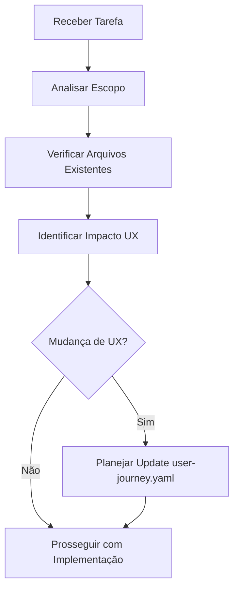

# 🤖 Protocolos Especiais para Claude Code

## Visão Geral

Este documento contém instruções específicas para Claude Code trabalhar de forma otimizada no projeto MadBoat v3, seguindo os protocolos estabelecidos pelo sistema de agentes e garantindo consistência com a arquitetura e filosofia do projeto.

## Regras Fundamentais

### 🚫 Proibições Absolutas

#### 1. Gerenciamento de Arquivos
```bash
# NUNCA fazer:
- Criar arquivos de contexto separados além de .kraken/context.yaml
- Sobrescrever o arquivo principal de contexto
- Usar caminhos relativos em respostas finais
- Criar documentação não solicitada (README.md, etc.)
```

#### 2. Modificações de Configuração
```bash
# NUNCA fazer:
- git config (qualquer alteração)
- Modificar package.json sem necessidade específica
- Alterar configurações do TypeScript strict mode
- Modificar configurações do Supabase sem coordenação
```

### ✅ Obrigações Críticas

#### 1. Context Management Protocol
```yaml
SEMPRE:
  - Append ao .kraken/context.yaml (NUNCA criar separado)
  - Usar formato estruturado para sessões
  - Incluir timestamp e agente responsável
  - Salvar após completar trabalho importante
  - Atualizar .kraken/user-journey.yaml para mudanças UX

FORMATO_OBRIGATÓRIO: |
  session_YYYY_MM_DD_description:
    agent: "claude-code"
    timestamp: "2025-09-25T10:30:00Z"
    accomplishments: []
    decisions: []
    technical_changes: []
    integrations: []
    next_steps: []
```

#### 2. User Journey Update Protocol
```yaml
SEMPRE_ATUALIZAR_user-journey.yaml_QUANDO:
  - Novo card adicionado ao sistema de progressão
  - Modal content ou flow modificado
  - Animation sequences alteradas
  - User experience milestones criados/modificados
  - Design system elements atualizados
  - Technical architecture affecting UX changed

SEÇÕES_OBRIGATÓRIAS:
  - cards: Especificação completa com posicionamento
  - modal_system: Documentação de novos modals
  - changelog: Data e mudanças implementadas
  - user_progression: Novos milestones
  - future_expansions: Roadmap atualizado
```

#### 3. Code Quality Standards
```typescript
// SEMPRE enforçar:
type RequiredStandards = {
  typescript: 'strict mode only';
  imports: 'absolute paths in final responses';
  testing: 'business logic tests prioritized';
  documentation: 'only when explicitly requested';
  emojis: 'never use unless explicitly requested';
};
```

## Protocolos de Desenvolvimento

### 🎯 Workflow Padrão

#### 1. Análise Inicial


#### 2. Implementação
```yaml
steps:
  1. Read existing files first (ALWAYS)
  2. Prefer editing over creating new files
  3. Follow TypeScript strict patterns
  4. Implement with accessibility in mind
  5. Add proper error handling
  6. Include performance considerations
```

#### 3. Finalização
```yaml
steps:
  1. Update .kraken/context.yaml
  2. Update .kraken/user-journey.yaml (if UX change)
  3. Use absolute paths in responses
  4. Provide code snippets and file paths
  5. Summarize changes clearly
```

### 🏗️ Architectural Guidelines

#### 1. React 19 + Next.js 15 Patterns
```typescript
// SEMPRE usar:
- Server Components when appropriate
- Actions for form handling
- useActionState for form state
- Suspense boundaries for loading
- TypeScript strict mode
- Proper error boundaries

// EVITAR:
- Client components desnecessários
- any types
- Inline styles (use Tailwind)
- Direct DOM manipulation
- Uncontrolled components without justification
```

#### 2. Estado e Props
```typescript
// Patterns obrigatórios:
interface PropsPattern {
  // Always define interfaces for props
  id: string;
  className?: string;
  children?: React.ReactNode;
  // Use branded types for IDs
  userId: UserId;
  // Prefer union types over booleans when possible
  variant: 'primary' | 'secondary' | 'ghost';
}

// Estado sempre com useReducer para complexidade média+
type StateAction =
  | { type: 'SET_LOADING'; payload: boolean }
  | { type: 'SET_ERROR'; payload: string | null }
  | { type: 'SET_DATA'; payload: any };
```

#### 3. Styling Conventions
```css
/* SEMPRE usar Tailwind classes */
.component {
  @apply flex items-center justify-center;
  @apply bg-white text-black border border-gray-200;
  @apply hover:bg-gray-50 transition-colors duration-200;
  @apply focus:outline-none focus:ring-2 focus:ring-black;
}

/* Monochrome palette enforcement */
:root {
  --primary: black;
  --secondary: white;
  --accent: only when strategically necessary;
}
```

### 🎮 Modal System Guidelines

#### 1. Modal Architecture
```typescript
// SEMPRE seguir o pattern estabelecido:
interface ModalImplementation {
  // Use compound components
  structure: 'Modal.Header + Modal.Body + Modal.Footer';

  // Register in modal-definitions.ts
  registration: 'Required for all new modals';

  // Animation duration consistency
  duration: 3000; // 3 seconds standard

  // Accessibility compliance
  accessibility: 'ARIA labels, focus management, escape key';

  // Mobile responsiveness
  responsive: 'Mobile-first approach';
}

// Pattern para novos modals:
const NewModal = ({ isOpen, onClose, data }: NewModalProps) => (
  <Modal isOpen={isOpen} onClose={onClose} size="lg">
    <Modal.Header>
      <h2>Modal Title</h2>
    </Modal.Header>
    <Modal.Body>
      {/* Content with proper TypeScript types */}
    </Modal.Body>
    <Modal.Footer align="right">
      <Button onClick={handleAction}>Action</Button>
    </Modal.Footer>
  </Modal>
);
```

#### 2. Animation Standards
```typescript
// Usar Framer Motion com estes presets:
const modalAnimations = {
  initial: { scale: 0.8, opacity: 0 },
  animate: { scale: 1, opacity: 1 },
  exit: { scale: 0.8, opacity: 0 },
  transition: {
    type: 'spring',
    damping: 25,
    stiffness: 300,
    duration: 0.8
  }
};

// Professional easing curve
const easings = {
  professional: [0.23, 1, 0.32, 1]
};
```

### 🗄️ Database Integration

#### 1. Supabase Patterns
```typescript
// SEMPRE usar tipos gerados:
import { Database } from '@/types/supabase';
type Profile = Database['public']['Tables']['profiles']['Row'];

// Client-side queries com error handling:
const { data, error } = await supabase
  .from('profiles')
  .select('*')
  .eq('id', userId);

if (error) {
  throw new DatabaseError('Failed to fetch profile', error);
}

// RLS sempre habilitado para dados de usuário
// Usar auth.uid() em policies
```

#### 2. Migration Standards
```sql
-- SEMPRE incluir:
-- 1. Descriptive migration name
-- 2. Proper constraints
-- 3. Indexes for performance
-- 4. RLS policies
-- 5. Trigger for updated_at
-- 6. Comments explaining business logic

CREATE TABLE example (
  id UUID DEFAULT gen_random_uuid() PRIMARY KEY,
  user_id UUID REFERENCES auth.users(id) ON DELETE CASCADE NOT NULL,

  -- Business fields with constraints
  name TEXT NOT NULL CHECK (char_length(name) >= 3),

  -- Timestamps
  created_at TIMESTAMP WITH TIME ZONE DEFAULT timezone('utc'::TEXT, now()) NOT NULL,
  updated_at TIMESTAMP WITH TIME ZONE DEFAULT timezone('utc'::TEXT, now()) NOT NULL
);

-- Performance indexes
CREATE INDEX idx_example_user_id ON example(user_id);

-- RLS
ALTER TABLE example ENABLE ROW LEVEL SECURITY;
CREATE POLICY "Users can manage own records" ON example FOR ALL USING (auth.uid() = user_id);

-- Updated_at trigger
CREATE TRIGGER update_example_updated_at
  BEFORE UPDATE ON example
  FOR EACH ROW
  EXECUTE PROCEDURE update_updated_at_column();
```

## Protocolos de Comunicação

### 📡 Agent Coordination

#### 1. Quando Consultar Outros Agentes
```yaml
consultar_kraken_quando:
  - Decisões arquiteturais importantes
  - Mudanças que afetam múltiplos sistemas
  - Conflitos de implementação
  - Priorização de features

consultar_mandarin_fish_quando:
  - Mudanças significativas na UI
  - Novos padrões de design
  - Alterações no sistema de modals
  - Questões de acessibilidade

consultar_poseidon_quando:
  - Schema changes
  - Performance queries
  - Migrations complexas
  - Data modeling decisions
```

#### 2. Context Sharing Format
```yaml
session_2025_09_25_claude_code_modal_enhancement:
  agent: "claude-code"
  timestamp: "2025-09-25T14:30:00Z"
  coordination:
    - consulted_agent: "mandarin-fish"
    - reason: "Modal UX enhancement decisions"
    - outcome: "Approved design pattern for Modal 4"

  accomplishments:
    - "Enhanced Modal 2 with story editing capabilities"
    - "Added export functionality to user stories"
    - "Implemented mobile-optimized modal layouts"

  technical_changes:
    - file: "apps/web/src/components/modals/DiaryModal.tsx"
      type: "CREATED"
      description: "Complete diary modal with story management"
    - file: "apps/web/src/systems/modal-definitions.ts"
      type: "MODIFIED"
      description: "Added diary modal registration"

  decisions:
    - "Used virtualized list for story collection (performance)"
    - "Implemented export to JSON/CSV formats"
    - "Added search and filter capabilities"

  integrations:
    - system: "modal_system"
      description: "Fully integrated with existing modal architecture"
    - system: "user_journey"
      description: "Updated progression triggers for Modal 2 completion"

  next_steps:
    - "Test modal responsiveness across devices"
    - "Add keyboard navigation for power users"
    - "Implement story analytics dashboard"
```

## Error Handling e Recovery

### 🚨 Error Response Patterns

#### 1. Development Errors
```typescript
// Pattern para lidar com erros durante desenvolvimento:
class DevelopmentError extends Error {
  constructor(
    message: string,
    public context: Record<string, unknown>,
    public recovery?: string
  ) {
    super(message);
    this.name = 'DevelopmentError';
  }
}

// Sempre incluir contexto para debugging:
throw new DevelopmentError(
  'Modal registration failed',
  { modalType, registryState },
  'Check modal-definitions.ts for correct structure'
);
```

#### 2. User-Facing Errors
```typescript
// Pattern para erros de usuário:
interface UserError {
  message: string;
  action?: string;
  recoverable: boolean;
}

// Mensagens sempre em português para usuário final
const errorMessages = {
  storyTooShort: {
    message: 'Sua história precisa ter pelo menos 10 palavras.',
    action: 'Continue escrevendo para desbloquear o próximo passo.',
    recoverable: true
  }
};
```

## Testing Protocols

### 🧪 Testing Standards

#### 1. Priorização de Testes
```typescript
// Ordem de prioridade:
1. Business Logic Tests (hooks, utilities, actions)
2. Component Integration Tests (user interactions)
3. Unit Tests (individual components)
4. E2E Tests (critical user flows)

// React 19 considerations:
// - Focus on business logic over component implementation
// - Test Actions instead of form submissions
// - Mock external dependencies properly
```

#### 2. Test Patterns
```typescript
// Pattern obrigatório para testes:
describe('StorySubmission', () => {
  it('should calculate word count correctly', () => {
    const story = 'This is a test story with more than ten words here.';
    const wordCount = calculateWordCount(story);
    expect(wordCount).toBe(12);
  });

  it('should validate minimum word requirement', () => {
    const shortStory = 'Too short';
    const result = validateStory(shortStory);
    expect(result.isValid).toBe(false);
    expect(result.error).toContain('pelo menos 10 palavras');
  });
});

// Integration test pattern:
describe('GameModalFlow', () => {
  it('should unlock Card 2 after story submission', async () => {
    render(<GameJourney />);

    // Submit story
    await userEvent.type(getByRole('textbox'), validStory);
    await userEvent.click(getByText('ALIMENTAR'));

    // Verify Card 2 appears
    await waitFor(() => {
      expect(getByText('DIÁRIO DE BORDO')).toBeVisible();
    });
  });
});
```

## Performance Guidelines

### ⚡ Optimization Requirements

#### 1. Bundle Size Management
```typescript
// SEMPRE considerar:
- Dynamic imports for large components
- Tree shaking optimization
- Minimize external dependencies
- Use React.lazy for modal content
- Implement proper code splitting

// Target metrics:
const performanceTargets = {
  initialBundle: '<300KB gzipped',
  modalChunks: '<50KB per modal',
  firstLoad: '<2 seconds',
  interaction: '<100ms latency'
};
```

#### 2. Animation Performance
```typescript
// SEMPRE usar hardware acceleration:
const animationOptimization = {
  transform: 'translate3d(0, 0, 0)', // Force hardware acceleration
  willChange: 'transform, opacity', // Optimize for changes
  contain: 'layout style paint', // Limit repaints
  backfaceVisibility: 'hidden' // Prevent flickering
};

// Respectar prefers-reduced-motion:
@media (prefers-reduced-motion: reduce) {
  * {
    animation-duration: 0.01ms !important;
    transition-duration: 0.01ms !important;
  }
}
```

## Final Checklist

### ✅ Before Completing Any Task

```yaml
verification_checklist:
  1. ✅ Read existing files before editing
  2. ✅ Follow TypeScript strict mode
  3. ✅ Use absolute paths in responses
  4. ✅ Update .kraken/context.yaml if significant work
  5. ✅ Update .kraken/user-journey.yaml if UX change
  6. ✅ Prefer editing existing files over creating new
  7. ✅ Include error handling and edge cases
  8. ✅ Consider accessibility implications
  9. ✅ Test responsive behavior mentally
  10. ✅ Provide clear code snippets and explanations

never_forget:
  - "Do what has been asked; nothing more, nothing less"
  - "ALWAYS prefer editing existing files"
  - "NEVER create files unless absolutely necessary"
  - "Use absolute paths in final responses"
  - "No emojis unless explicitly requested"
```

Estes protocolos garantem que Claude Code trabalhe de forma consistente com o ecossistema MadBoat v3, mantendo qualidade, performance e alinhamento com a arquitetura de agentes especializados.